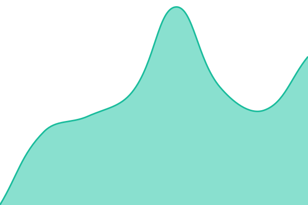
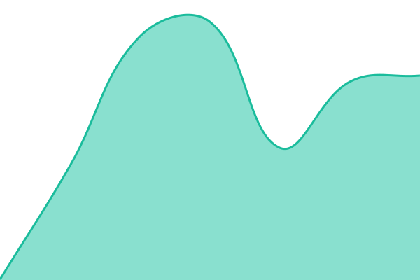
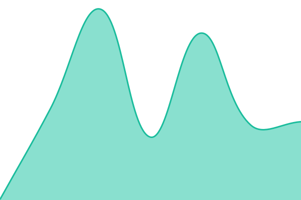
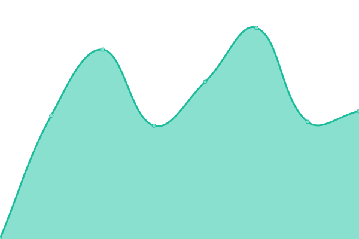
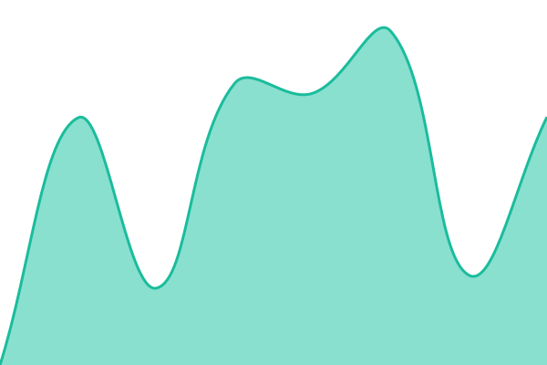

# [📈 Live Status](https://upptime.github.io/upptime): <!--live status--> **🟧 Partial outage**

This repository contains the open-source uptime monitor and status page for [Upptime](https://upptime.js.org), powered by [Upptime](https://github.com/upptime/upptime).

With [Upptime](https://upptime.js.org), you can get your own unlimited and free uptime monitor and status page, powered entirely by a GitHub repository. We use [Issues](https://github.com/upptime/upptime/issues) as incident reports, [Actions](https://github.com/longforme/longforme-uptime-monitor/actions) as uptime monitors, and [Pages](https://upptime.github.io/upptime) for the status page.

<!--start: status pages-->
<!-- This summary is generated by Upptime (https://github.com/upptime/upptime) -->
<!-- Do not edit this manually, your changes will be overwritten -->
<!-- prettier-ignore -->
| URL | Status | History | Response Time | Uptime |
| --- | ------ | ------- | ------------- | ------ |
|  [Long Forme](https://longforme.com) | 🟩 Up | [long-forme.yml](https://github.com/longforme/longforme-uptime-monitor/commits/HEAD/history/long-forme.yml) | 

 1434ms
     
 | 

<a href="https://longforme.github.io/longforme-uptime-monitor/history/long-forme">0.00%</a>
    

|  [JAU](https://www.jau.co.jp) | 🟩 Up | [jau.yml](https://github.com/longforme/longforme-uptime-monitor/commits/HEAD/history/jau.yml) | 

 702ms
     
 | 

<a href="https://longforme.github.io/longforme-uptime-monitor/history/jau">100.00%</a>
    

|  [Addition Studio](https://additionstudio.jau.co.jp) | 🟩 Up | [addition-studio.yml](https://github.com/longforme/longforme-uptime-monitor/commits/HEAD/history/addition-studio.yml) | 

 389ms
     
 | 

<a href="https://longforme.github.io/longforme-uptime-monitor/history/addition-studio">100.00%</a>
    

|  [Subtle Bodies](https://subtle-bodies.jau.co.jp) | 🟩 Up | [subtle-bodies.yml](https://github.com/longforme/longforme-uptime-monitor/commits/HEAD/history/subtle-bodies.yml) | 

 646ms
     
 | 

<a href="https://longforme.github.io/longforme-uptime-monitor/history/subtle-bodies">100.00%</a>
    

|  [Seljak](https://seljak.jau.co.jp) | 🟩 Up | [seljak.yml](https://github.com/longforme/longforme-uptime-monitor/commits/HEAD/history/seljak.yml) | 

 344ms
     
 | 

<a href="https://longforme.github.io/longforme-uptime-monitor/history/seljak">100.00%</a>
    

|  [KeepCup](https://keepcup.eco.jau.co.jp) | 🟩 Up | [keep-cup.yml](https://github.com/longforme/longforme-uptime-monitor/commits/HEAD/history/keep-cup.yml) | 

 311ms
     
 | 

<a href="https://longforme.github.io/longforme-uptime-monitor/history/keep-cup">100.00%</a>
    

|  [Posie](https://posie.jau.co.jp) | 🟩 Up | [posie.yml](https://github.com/longforme/longforme-uptime-monitor/commits/HEAD/history/posie.yml) | 

 521ms
     
 | 

<a href="https://longforme.github.io/longforme-uptime-monitor/history/posie">100.00%</a>
    

|  [Botanica](https://botanica.jau.co.jp) | 🟩 Up | [botanica.yml](https://github.com/longforme/longforme-uptime-monitor/commits/HEAD/history/botanica.yml) | 

 416ms
     
 | 

<a href="https://longforme.github.io/longforme-uptime-monitor/history/botanica">100.00%</a>
    

|  [Champ](https://champ.jau.co.jp) | 🟥 Down | [champ.yml](https://github.com/longforme/longforme-uptime-monitor/commits/HEAD/history/champ.yml) | 

 326ms
     
 | 

<a href="https://longforme.github.io/longforme-uptime-monitor/history/champ">0.00%</a>
    

|  [Northern Light](https://northernlight.jau.co.jp) | 🟩 Up | [northern-light.yml](https://github.com/longforme/longforme-uptime-monitor/commits/HEAD/history/northern-light.yml) | 

 295ms
     
 | 

<a href="https://longforme.github.io/longforme-uptime-monitor/history/northern-light">100.00%</a>
    

|  [MAHO](https://maho.jau.co.jp) | 🟩 Up | [maho.yml](https://github.com/longforme/longforme-uptime-monitor/commits/HEAD/history/maho.yml) | 

 191ms
     
 | 

<a href="https://longforme.github.io/longforme-uptime-monitor/history/maho">100.00%</a>
    

|  [HHHWWW](https://hhhwww.jp) | 🟥 Down | [hhhwww.yml](https://github.com/longforme/longforme-uptime-monitor/commits/HEAD/history/hhhwww.yml) | 

 0ms
     
 | 

<a href="https://longforme.github.io/longforme-uptime-monitor/history/hhhwww">0.00%</a>
    

|  [HHHWWW store](https://hhhwww.jau.co.jp) | 🟩 Up | [hhhwww-store.yml](https://github.com/longforme/longforme-uptime-monitor/commits/HEAD/history/hhhwww-store.yml) | 

 2473ms
     
 | 

<a href="https://longforme.github.io/longforme-uptime-monitor/history/hhhwww-store">100.00%</a>
    

<!--end: status pages-->

[**Visit our status website →**](https://upptime.github.io/upptime)

## 📄 License

- Powered by: [Upptime](https://github.com/upptime/upptime)
- Code: [MIT](./LICENSE) © [Upptime](https://upptime.js.org)
- Data in the `./history` directory: [Open Database License](https://opendatacommons.org/licenses/odbl/1-0/)
