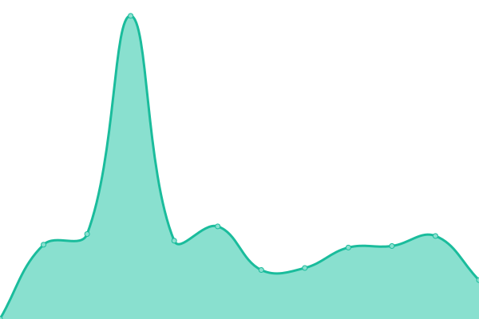

# [📈 Live Status](https://upptime.github.io/upptime): <!--live status--> **🟧 Partial outage**

This repository contains the open-source uptime monitor and status page for [Upptime](https://upptime.js.org), powered by [Upptime](https://github.com/upptime/upptime).

With [Upptime](https://upptime.js.org), you can get your own unlimited and free uptime monitor and status page, powered entirely by a GitHub repository. We use [Issues](https://github.com/upptime/upptime/issues) as incident reports, [Actions](https://github.com/longforme/longforme-uptime-monitor/actions) as uptime monitors, and [Pages](https://upptime.github.io/upptime) for the status page.

<!--start: status pages-->
<!-- This summary is generated by Upptime (https://github.com/upptime/upptime) -->
<!-- Do not edit this manually, your changes will be overwritten -->
<!-- prettier-ignore -->
| URL | Status | History | Response Time | Uptime |
| --- | ------ | ------- | ------------- | ------ |
|  [Long Forme](https://longforme.com) | 🟩 Up | [long-forme.yml](https://github.com/longforme/longforme-uptime-monitor/commits/HEAD/history/long-forme.yml) | 

 613ms
     
 | 

<a href="https://longforme.github.io/longforme-uptime-monitor/history/long-forme">100.00%</a>
    

|  [JAU](https://jau.co.jp) | 🟩 Up | [jau.yml](https://github.com/longforme/longforme-uptime-monitor/commits/HEAD/history/jau.yml) | 

 468ms
     
 | 

<a href="https://longforme.github.io/longforme-uptime-monitor/history/jau">100.00%</a>
    

|  [JAU Shop](https://shop.jau.co.jp) | 🟩 Up | [jau-shop.yml](https://github.com/longforme/longforme-uptime-monitor/commits/HEAD/history/jau-shop.yml) | 

 228ms
     
 | 

<a href="https://longforme.github.io/longforme-uptime-monitor/history/jau-shop">100.00%</a>
    

|  [Addition Studio](https://additionstudio.jau.co.jp) | 🟩 Up | [addition-studio.yml](https://github.com/longforme/longforme-uptime-monitor/commits/HEAD/history/addition-studio.yml) | 

 785ms
     
 | 

<a href="https://longforme.github.io/longforme-uptime-monitor/history/addition-studio">99.22%</a>
    

|  [Subtle Bodies](https://subtle-bodies.jau.co.jp) | 🟩 Up | [subtle-bodies.yml](https://github.com/longforme/longforme-uptime-monitor/commits/HEAD/history/subtle-bodies.yml) | 

 660ms
     
 | 

<a href="https://longforme.github.io/longforme-uptime-monitor/history/subtle-bodies">100.00%</a>
    

|  [Seljak](https://seljak.jau.co.jp) | 🟩 Up | [seljak.yml](https://github.com/longforme/longforme-uptime-monitor/commits/HEAD/history/seljak.yml) | 

 707ms
     
 | 

<a href="https://longforme.github.io/longforme-uptime-monitor/history/seljak">100.00%</a>
    

|  [Less Plastic](https://lessplastic.jau.co.jp) | 🟩 Up | [less-plastic.yml](https://github.com/longforme/longforme-uptime-monitor/commits/HEAD/history/less-plastic.yml) | 

 545ms
     
 | 

<a href="https://longforme.github.io/longforme-uptime-monitor/history/less-plastic">100.00%</a>
    

|  [Less Plastic Shop](https://shop.lessplastic.jau.co.jp) | 🟩 Up | [less-plastic-shop.yml](https://github.com/longforme/longforme-uptime-monitor/commits/HEAD/history/less-plastic-shop.yml) | 

 111ms
     
 | 

<a href="https://longforme.github.io/longforme-uptime-monitor/history/less-plastic-shop">99.65%</a>
    

|  [KeepCup](https://keepcup.eco.jau.co.jp) | 🟩 Up | [keep-cup.yml](https://github.com/longforme/longforme-uptime-monitor/commits/HEAD/history/keep-cup.yml) | 

 197ms
     
 | 

<a href="https://longforme.github.io/longforme-uptime-monitor/history/keep-cup">98.73%</a>
    

|  [Posie](https://posie.jau.co.jp) | 🟩 Up | [posie.yml](https://github.com/longforme/longforme-uptime-monitor/commits/HEAD/history/posie.yml) | 

 124ms
     
 | 

<a href="https://longforme.github.io/longforme-uptime-monitor/history/posie">96.20%</a>
    

|  [Botanica](https://botanica.jau.co.jp) | 🟩 Up | [botanica.yml](https://github.com/longforme/longforme-uptime-monitor/commits/HEAD/history/botanica.yml) | 

 3666ms
     
 | 

<a href="https://longforme.github.io/longforme-uptime-monitor/history/botanica">100.00%</a>
    

|  [Champ](https://champ.jau.co.jp) | 🟩 Up | [champ.yml](https://github.com/longforme/longforme-uptime-monitor/commits/HEAD/history/champ.yml) | 

 768ms
     
 | 

<a href="https://longforme.github.io/longforme-uptime-monitor/history/champ">100.00%</a>
    

|  [Northern Light](https://northernlight.jau.co.jp) | 🟩 Up | [northern-light.yml](https://github.com/longforme/longforme-uptime-monitor/commits/HEAD/history/northern-light.yml) | 

 605ms
     
 | 

<a href="https://longforme.github.io/longforme-uptime-monitor/history/northern-light">94.47%</a>
    

|  [MAHO](https://maho.jau.co.jp) | 🟥 Down | [maho.yml](https://github.com/longforme/longforme-uptime-monitor/commits/HEAD/history/maho.yml) | 

 359ms
     
 | 

<a href="https://longforme.github.io/longforme-uptime-monitor/history/maho">95.26%</a>
    

|  [HHHWWW](https://hhhwww.jp) | 🟩 Up | [hhhwww.yml](https://github.com/longforme/longforme-uptime-monitor/commits/HEAD/history/hhhwww.yml) | 

 816ms
     
 | 

<a href="https://longforme.github.io/longforme-uptime-monitor/history/hhhwww">100.00%</a>
    

|  [HHHWWW stpre](https://hhhwww.jau.co.jp) | 🟩 Up | [hhhwww-stpre.yml](https://github.com/longforme/longforme-uptime-monitor/commits/HEAD/history/hhhwww-stpre.yml) | 

 5709ms
     
 | 

<a href="https://longforme.github.io/longforme-uptime-monitor/history/hhhwww-stpre">100.00%</a>
    

<!--end: status pages-->

[**Visit our status website →**](https://upptime.github.io/upptime)

## 📄 License

- Powered by: [Upptime](https://github.com/upptime/upptime)
- Code: [MIT](./LICENSE) © [Upptime](https://upptime.js.org)
- Data in the `./history` directory: [Open Database License](https://opendatacommons.org/licenses/odbl/1-0/)
